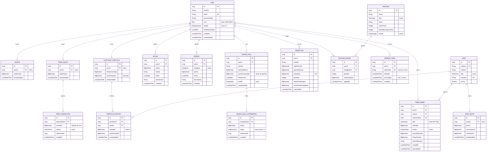

# Check-Out / Cash-Out

**Curso:** CS2031 Desarrollo Basado en Plataformas, 2026-2, UTEC

**Integrantes:**

| Nombre | Código |
|--------|--------|
| Azul Arbulú Silva | 202510303 |
| Alba Abigail Cabrera Pilco | 202510505 |
| Dylan Carlo Van Oordt Arbulú | 202510757 |
| Ary Fernando Sanchez Cerna | 201920061 |
| Miguel Angel Flores Cardenas | 202510147 |

---

## Índice

1. [Introducción](#introducción)
2. [Identificación del Problema o Necesidad](#identificación-del-problema-o-necesidad)
3. [Descripción de la Solución](#descripción-de-la-solución)
4. [Modelo de Entidades](#modelo-de-entidades)
5. [Manejo de Errores](#manejo-de-errores)
6. [Medidas de Seguridad Implementadas](#medidas-de-seguridad-implementadas)
7. [Eventos y Asincronía](#eventos-y-asincronía)
8. [GitHub & Management](#github--management)
9. [Conclusión](#conclusión)
10. [Apéndices](#apéndices)

---

## Introducción

### Contexto

Muchas personas jóvenes llegan a su primer sueldo sin haber manejado antes un
presupuesto propio, y aprenden a invertir arriesgando dinero
real desde el primer momento. _Check-Out / Cash-Out_ busca separar esas dos
etapas: primero, que el usuario entienda y controle sus finanzas reales y, en base a ello, invertir en un
entorno donde el riesgo son fichas de un juego y no su sueldo.

### Objetivos del Proyecto

- Brindarle al usuario una forma simple de registrar ingresos y gastos reales a la vez, permitirle
  fijar metas de ahorro con seguimiento disponible y comprometido.
- Motivar el buen hábito financiero mediante _tokens_ de juego que no involucran
  dinero real.
- Ofrecer un simulador de inversión tomando esas mismas fichas para que el usuario practique conceptos
  de mercado sin exponer capital real.
- Construir el _backend_ con separación estricta entre ambas economías, de modo
  que ningún endpoint pueda acreditar fichas o mover dinero real fuera de los
  flujos de negocio previstos.

---

## Identificación del Problema o Necesidad

### Descripción del Problema

La falta de educación financiera en los estudiantes universitarios, quienes están por comenzar su vida adulta.

### Justificación

Esta solución busca brindarles una herramienta para administrar sus gastos, monitorear sus ingresos y aprender del ahorro y gasto consciente del dinero. Además, informar a los jóvenes sobre los riesgos que se asumen al realizar distintas actividades tales como pedir préstamos, invertir o apostar, así como los beneficios de tener un buen historial crediticio.

---

## Descripción de la Solución

### Funcionalidades Implementadas

- **Autenticación y usuarios:** registro, login, refresh y logout con JWT;
  gestión del propio perfil (`/users/me`), cambio de contraseña con revocación
  de sesiones, y borrado lógico de cuenta.
- **Ahorro en soles:** registro de ingresos y gastos con filtros por fecha y
  categoría, metas de ahorro y aportes ("sobre virtual") que comprometen saldo
  sin moverlo, y un endpoint de resumen (`/savings`) con saldo, comprometido y
  disponible.
- **Monedero de fichas:** consulta de saldo y del libro de movimientos
  (`/token-wallet`), sin ningún endpoint de escritura: las fichas solo se
  generan como efecto de cumplir metas, jugar minijuegos u operar en la
  cartera.
- **Inversión simulada:** catálogo de activos con cotización vigente e
  histórico de precios, colocación y cancelación de órdenes con idempotencia,
  posiciones abiertas y PnL de la cartera.
- **Minijuegos:** catálogo administrable de minijuegos y registro de partidas
  jugadas, con un tope (`maxTokenReward`) que acota el daño posible de una
  puntuación manipulada del lado del cliente.
- **Proyecciones:** cálculo de interés simple vs. compuesto para que el
  usuario proyecte el crecimiento de sus metas.
- **Correo transaccional:** envío de correos (con o sin adjunto) al usuario
  autenticado, disparado de forma asíncrona por eventos de dominio.

### Tecnologías Utilizadas

| Pieza | Versión | Por qué |
|---|---|---|
| Java | 21 | LTS; se usan `record`, pattern matching y text blocks |
| Spring Boot | 4.1.1 | versión estable, sin artefactos pre-release |
| Spring Security | 7 | `SecurityFilterChain` y `@EnableMethodSecurity` |
| jjwt | 0.13 | firma y verificación de los JWT |
| PostgreSQL | 16 | base de datos de desarrollo y producción |
| H2 | en memoria, modo PostgreSQL | base de los tests, sin necesidad de Docker |
| Hibernate / JPA | del BOM de Boot | persistencia |
| ModelMapper | 3.2 | mapeo Entity ↔ DTO en estrategia STRICT |
| SpringDoc OpenAPI | 2.x | documentación navegable de la API (Swagger) |
| Maven (wrapper) | incluido | build sin instalar Maven localmente |
| Docker / Docker Compose | — | orquesta PostgreSQL y la aplicación |

La API completa cuelga de `/api/v1` (versionado centralizado en
`web/ApiVersioningConfig`) y está documentada también en una colección de
Postman en la raíz del repositorio.

---

## Modelo de Entidades



### Descripción de Entidades

El esquema tiene 17 tablas organizadas por dominio de negocio:

- **User:** cuenta del usuario, credenciales, rol y estado (activo/inactivo
  vía borrado lógico).
- **Savings:** saldo real del usuario en soles; relación 1:1 con `User`
  (`UNIQUE(user_id)`).
- **Income / Expense:** movimientos reales de ingreso y gasto, asociados al
  usuario y a su registro de `Savings` (1:N desde ambos).
- **SavingsGoal:** meta de ahorro con monto objetivo y estado (en progreso,
  cumplida); relación 1:N con `User`.
- **Contribution:** aporte de un usuario a una `SavingsGoal`; representa el
  "compromiso" de saldo sin moverlo.
- **TokenWallet:** monedero de fichas del usuario, 1:1 con `User`
  (`UNIQUE(user_id)`).
- **TokenTransaction:** libro de movimientos de fichas, con
  `UNIQUE(motivo, referencia)` para garantizar idempotencia.
- **RefreshToken:** tokens de refresco almacenados como hash, con rotación y
  revocación por familia.
- **InvestmentPortfolio:** cartera simulada del usuario, 1:1 con `User`
  (`UNIQUE(user_id)`).
- **Asset:** catálogo de activos disponibles para operar.
- **AssetQuote:** cotización vigente de un activo (`UNIQUE(asset_id)`).
- **AssetPriceHistory:** histórico de cierres por activo y fecha
  (`UNIQUE(asset_id, date)`).
- **Position:** posición abierta de un usuario sobre un activo dentro de su
  `InvestmentPortfolio`.
- **TradeOrder:** orden de compra/venta, con `clientOrderId` único para
  idempotencia y estados incluyendo `REJECTED`.
- **Minigame:** catálogo de minijuegos, con `maxTokenReward` como tope de
  recompensa.
- **MinigameSession:** partida jugada por un usuario sobre un `Minigame`;
  es la tabla que resuelve como N:N la participación de usuarios en
  minijuegos.
- **Projection:** proyección de interés simple o compuesto; relación 1:N con
  `User`.

### Relaciones entre Entidades

| Relación | Cardinalidad |
|---|---|
| `User` – `Income` | 1:N |
| `User` – `Expense` | 1:N |
| `User` – `Savings` | 1:1 |
| `User` – `SavingsGoal` | 1:N |
| `User` – `TokenWallet` | 1:1 |
| `User` – `InvestmentPortfolio` | 1:1 |
| `User` – `Projection` | 1:N |
| `User` – `Minigame` (vía `MinigameSession`) | N:N |
| `Savings` – `Expense` | 1:N |
| `Savings` – `Income` | 1:N |
| `SavingsGoal` – `Contribution` | 1:N |
| `TokenWallet` – `TokenTransaction` | 1:N |
| `InvestmentPortfolio` – `Position` | 1:N |
| `InvestmentPortfolio` / `Asset` – `TradeOrder` | 1:N cada uno |
| `Asset` – `AssetQuote` | 1:1 |
| `Asset` – `AssetPriceHistory` | 1:N |

Las relaciones 1:1 (`Savings`, `TokenWallet`, `InvestmentPortfolio` con
`User`) se garantizan a nivel de esquema con `UNIQUE(user_id)`, no solo en
código. Las claves foráneas están nombradas explícitamente y existen índices
en las columnas usadas para filtrar (fechas, categorías, usuario).

> **Nota respecto a la propuesta inicial (Entregable 1):** la propuesta
> planteaba `User`–`InvestmentPortfolio` y `User`–`Minigame` como relaciones
> N:N directas. En la implementación final, `InvestmentPortfolio` pasó a ser
> 1:1 con `User` (cada usuario tiene una única cartera, y dentro de ella
> puede tener múltiples `Position` sobre distintos `Asset`); y la relación N:N con `Minigame` se resolvió con la
> tabla intermedia explícita `MinigameSession`. El resto de entidades y cardinalidades de la
> propuesta se mantuvo, y se añadieron nuevas (`TokenTransaction`,
> `RefreshToken`, `Contribution`, `AssetQuote`, `AssetPriceHistory`,
> `Position`, `TradeOrder`) que la propuesta inicial no incluía.

El esquema real se encuentra en migraciones Flyway
(`src/main/resources/db/migration`), y Hibernate solo valida contra ellas al
arrancar: si una entidad y una migración no coinciden, la aplicación no
levanta. Esto evita que el modelo de datos de código y el de base de datos
diverjan silenciosamente entre entornos.

---

## Manejo de Errores

Todos los endpoints devuelven el mismo formato de error, resuelto por un
`@ControllerAdvice` global:

```json
{
  "timestamp": "2026-09-25T14:03:31.758",
  "status": 400,
  "error": "Bad Request",
  "message": "El aporte supera tu saldo disponible de 250.00.",
  "path": "/api/v1/savings-goals/3/contributions",
  "fieldErrors": [
    { "field": "amount", "message": "El monto debe ser mayor que cero." }
  ]
}
```

`fieldErrors` solo aparece cuando la causa es una validación por campo. Los
códigos de estado usados son:

| Código | Cuándo |
|---|---|
| `400` | validación, o una regla de negocio que depende del estado guardado |
| `401` | sin token, token inválido o expirado |
| `403` | autenticado pero sin el rol necesario |
| `404` | el recurso no existe, o es de otro usuario |
| `409` | duplicado, o conflicto de concurrencia (versión optimista) |
| `413` | adjunto demasiado grande |
| `500` | error interno; el mensaje nunca revela el detalle |

Dos decisiones deliberadas dentro de este manejo:

- **404 en vez de 403 para recursos ajenos.** Pedir un recurso de otro usuario
  devuelve `404`, no `403`: un `403` confirmaría que ese ID existe y es de
  otra persona, filtrando información.
- **Rechazo de negocio no es excepción.** Una orden sin fichas o sin posición
  suficiente no se modela como excepción: se evalúa antes de escribir y se
  persiste como `REJECTED` con `201`, porque una excepción que escapa de un
  método `@Transactional` deja la transacción en rollback-only aunque quien
  llama la atrape.

Las excepciones personalizadas están organizadas por categoría, lo
que permite que el _handler global_ las traduzca de forma consistente al
formato anterior.

---

## Medidas de Seguridad Implementadas

### Seguridad de Datos

- **JWT** con claims `sub` (email), `uid` (id de usuario), `roles`, `iat` y
  `exp`. El secreto se lee de variables de entorno, exige mínimo 32
  caracteres (256 bits para HS256) y la aplicación se niega a arrancar si no
  se cumple.
- **Refresh tokens** guardados como hash SHA-256, nunca en claro. Rotan en
  cada uso; si se detecta la reutilización de uno ya revocado, se revoca toda
  la familia de tokens del usuario como defensa ante un token robado.
- **BCrypt** para contraseñas, con política mínima de 8 caracteres incluyendo
  mayúscula, minúscula, dígito y símbolo.
- **Roles y autorización** con `@PreAuthorize` sobre operaciones sensibles
  (gestión de catálogo de activos y minijuegos, listado de usuarios).
- **Ownership resuelto en la consulta:** los repositorios usan
  `findByIdAndUserId(...)` en vez de `findById(...)` más una comprobación
  posterior, de modo que el filtro de pertenencia está en el `WHERE` y no se
  puede olvidar.
- **CORS** restringido por variable de entorno (`CORS_ALLOWED_ORIGINS`), sin
  comodín `*`, especialmente relevante porque las peticiones van con
  credenciales.
- Backend sin estado: no hay sesión de servidor, toda la identidad viaja en
  el JWT.

### Prevención de Vulnerabilidades

- **Inyección SQL:** uso de JPA/Hibernate con consultas parametrizadas; no
  hay concatenación de SQL con entrada de usuario.
- **Fuga de datos entre usuarios:** mitigada con el patrón de ownership en el
  `WHERE` y con la política de `404` sobre recursos ajenos.
- **Configuración insegura por omisión:** el archivo de configuración base es
  seguro por defecto (`DDL_AUTO=validate`, `SWAGGER_ENABLED=false`,
  `SHOW_SQL=false`); hay que pedir explícitamente lo contrario para
  desarrollo. Un test de build (`ConfigurationContractTest`) falla si una
  variable obligatoria no está documentada o si alguna credencial queda
  escrita en `application.properties`.
- **Condiciones de carrera sobre saldos:** `@Version` (bloqueo optimista) en
  `Savings`, `TokenWallet`, `SavingsGoal` e `InvestmentPortfolio`. Dos
  operaciones simultáneas sobre el mismo saldo no pueden pisarse: la segunda
  en escribir recibe `409` en vez de sobrescribir silenciosamente. Está
  verificado con hilos reales en `WalletConcurrencyTest`.
- **Reintentos que duplicarían dinero o fichas:** idempotencia vía
  `clientOrderId` único en órdenes y `(motivo, referencia)` único en
  movimientos de fichas, para que un reintento de red no ejecute la operación
  dos veces.
- **Manipulación de puntuación en minijuegos:** dado que el juego corre en el
  cliente, no se puede confiar en la puntuación recibida; el daño se acota
  con `maxTokenReward` (editable solo por ADMIN) y con el cobro por
  adelantado de cada partida, de modo que la peor manipulación posible
  equivale a jugar perfecto, no a generar fichas de la nada.
- **Auditoría:** cada movimiento de fichas queda registrado en
  `token_transactions` con el saldo resultante, de modo que una desviación se
  detecta revisando una sola fila.

---

## Eventos y Asincronía

El backend usa eventos de dominio para desacoplar la escritura financiera de
sus efectos secundarios. Cumplir una meta de ahorro y ejecutar una orden
publican eventos que son consumidos por listeners de tipo
`@TransactionalEventListener(phase = AFTER_COMMIT)`: el efecto (por ejemplo,
el correo de confirmación) solo se dispara si la transacción realmente hizo
commit.

Esto es importante porque un `@EventListener` normal corre dentro de la misma
transacción que generó el evento: si esa transacción termina en rollback, un
listener síncrono ya habría enviado un correo felicitando al usuario por una
meta que la base de datos nunca llegó a registrar. Un correo, a diferencia de
una fila de base de datos, no se puede deshacer.

El envío de correo en sí se ejecuta con `@Async` sobre un
`ThreadPoolTaskExecutor` configurado explícitamente, de modo que una demora o
falla del proveedor de correo no bloquea ni hace más lenta la respuesta al
usuario que disparó la operación financiera.

---

## GitHub & Management

El repositorio usa un workflow de GitHub Actions que se dispara con `on:
pull_request` (contra la rama por defecto) y `on: push` a `main`. El flujo,
en ambos casos:

1. Hace *checkout* del código.
2. Configura JDK 21 y cachea las dependencias de Maven.
3. Corre `./mvnw test`, la suite completa de pruebas.
4. Falla el workflow si algún test falla o si el build no compila.

Que la suite corra sobre **H2 en modo PostgreSQL** es lo que permite que este
paso no dependa de Docker ni de credenciales de base de datos en el CI: no
hay contenedor de PostgreSQL que levantar ni secretos que inyectar solo para
probar.

Este workflow es, junto con las **dos aprobaciones obligatorias** definidas en
el *ruleset* de la rama `main`, el segundo requisito que debe cumplirse antes
de poder mergear un pull request: código revisado y CI en verde.

El _CI_ corre compilación y la
suite de tests en cada pull request y en cada push a `main`, y los tests no
dependen de Docker ni de una base de datos externa porque corren contra H2 en
modo PostgreSQL.

---

## Conclusión

### Logros del Proyecto

El _backend_ maneja el flujo pensado originalmente: registro de
finanzas reales, metas de ahorro con compromiso de saldo, una economía de
fichas que no se puede falsear desde la _API_, y un simulador de inversión con
órdenes, posiciones y cotizaciones. La seguridad (_JWT_, roles, _ownership_,
control de concurrencia) y la trazabilidad (libro de movimientos de fichas,
migraciones versionadas) se priorizó y no fue un añadido posterior.

### Aprendizajes Clave


- El **bloqueo optimista** (`@Version`) resultó ser la única defensa real
  contra condiciones de carrera sobre saldos y fichas; las validaciones de
  Bean Validation, que en la propuesta parecían suficientes, no protegen
  contra dos peticiones concurrentes leyendo el mismo estado.
- Resolver el **rechazo de una orden antes de escribir**, en vez de lanzar y
  atrapar una excepción, evita marcar la transacción como rollback-only y
  fue clave para que "fichas insuficientes" se pudiera tratar como un
  resultado de negocio (`REJECTED`) y no como un error del sistema.
- Los **eventos post-commit** (`@TransactionalEventListener(AFTER_COMMIT)`)
  terminaron siendo la forma correcta de resolver la asincronía que la
  propuesta original pedía para notificaciones y procesamiento de
  recompensas, evitando que un correo o un cálculo se disparen sobre una
  transacción que después hace rollback.
- La limitada experiencia previa del equipo con APIs REST completas
  se compensó investigando
  sobre la marcha Java, Lombok y ModelMapper, tal como se había planeado.

### Trabajo Futuro

- Verificar la partida de los minijuegos del lado del servidor, en vez de
  confiar en la puntuación enviada por el cliente y acotarla solo con un
  tope máximo.
- Probar las migraciones Flyway dentro del build con Testcontainers, para que
  una migración mal escrita falle en CI y no solo al desplegar.
- Evaluar mover el deployment a AWS (ECS/EC2 + RDS) si el proyecto crece más
  allá de una plataforma de despliegue instantáneo.

---

## Apéndices

### Licencia

Proyecto desarrollado con fines académicos para el curso CS2031 Desarrollo
Basado en Plataformas (UTEC, 2026-2). No cuenta con una licencia de código
abierto formal; su uso y distribución fuera del curso requiere autorización
de los integrantes listados en la portada.

### Referencias

+ Apache Software Foundation. (n.d.). Apache Maven documentation. https://maven.apache.org/guides/index.html
+ Broadcom Inc. (n.d.). Create an OCI image. Spring Boot Maven Plugin Reference Guide. https://docs.spring.io/spring-boot/4.1.1/maven-plugin/build-image.html

+ Broadcom Inc. (n.d.). Docker Compose support. Spring Boot Reference Documentation. https://docs.spring.io/spring-boot/4.1.1/reference/features/dev-services.html#features.dev-services.docker-compose

+ Broadcom Inc. (n.d.). OAuth2 client. Spring Boot Reference Documentation. https://docs.spring.io/spring-boot/4.1.1/reference/web/spring-security.html#web.security.oauth2.client

+ Broadcom Inc. (n.d.). Spring Boot DevTools. Spring Boot Reference Documentation. https://docs.spring.io/spring-boot/4.1.1/reference/using/devtools.html

+ Broadcom Inc. (n.d.). Spring Boot Maven Plugin reference guide. https://docs.spring.io/spring-boot/4.1.1/maven-plugin

+ Broadcom Inc. (n.d.). Spring Data JPA. Spring Boot Reference Documentation. https://docs.spring.io/spring-boot/4.1.1/reference/data/sql.html#data.sql.jpa-and-spring-data

+ Broadcom Inc. (n.d.). Spring Security. Spring Boot Reference Documentation. https://docs.spring.io/spring-boot/4.1.1/reference/web/spring-security.html

+ Broadcom Inc. (n.d.). Spring Web. Spring Boot Reference Documentation. https://docs.spring.io/spring-boot/4.1.1/reference/web/servlet.html

+ Conventional Commits. (n.d.). Conventional Commits 1.0.0. https://www.conventionalcommits.org/en/v1.0.0/#summary

+ GitHub. (n.d.). Creating a branch for an issue. GitHub Docs. https://docs.github.com/en/issues/tracking-your-work-with-issues/using-issues/creating-a-branch-for-an-issue

+ GitHub. (n.d.). Creating a pull request. GitHub Docs. https://docs.github.com/en/pull-requests/how-tos/create-pull-requests/creating-a-pull-request

+ GitHub. (n.d.). Linking a pull request to an issue. GitHub Docs. https://docs.github.com/en/issues/tracking-your-work-with-issues/using-issues/linking-a-pull-request-to-an-issue

+ GitHub. (n.d.). Request a pull request review. GitHub Docs. https://docs.github.com/en/pull-requests/how-tos/create-pull-requests/requesting-a-pull-request-review

+ GitHub. (n.d.). Reviewing proposed changes in a pull request. GitHub Docs. https://docs.github.com/en/pull-requests/how-tos/review-pull-requests/reviewing-proposed-changes-in-a-pull-request

+ Spring. (n.d.). Accessing data with JPA. https://spring.io/guides/gs/accessing-data-jpa/

+ Spring. (n.d.). Authenticating a user with LDAP. https://spring.io/guides/gs/authenticating-ldap/

+ Spring. (n.d.). Building a RESTful web service. https://spring.io/guides/gs/rest-service/

+ Spring. (n.d.). Building REST services with Spring. https://spring.io/guides/tutorials/rest/

+ Spring. (n.d.). Securing a web application. https://spring.io/guides/gs/securing-web/

+ Spring. (n.d.). Serving web content with Spring MVC. https://spring.io/guides/gs/serving-web-content/

+ Spring. (n.d.). Spring Boot and OAuth2. https://spring.io/guides/tutorials/spring-boot-oauth2/
